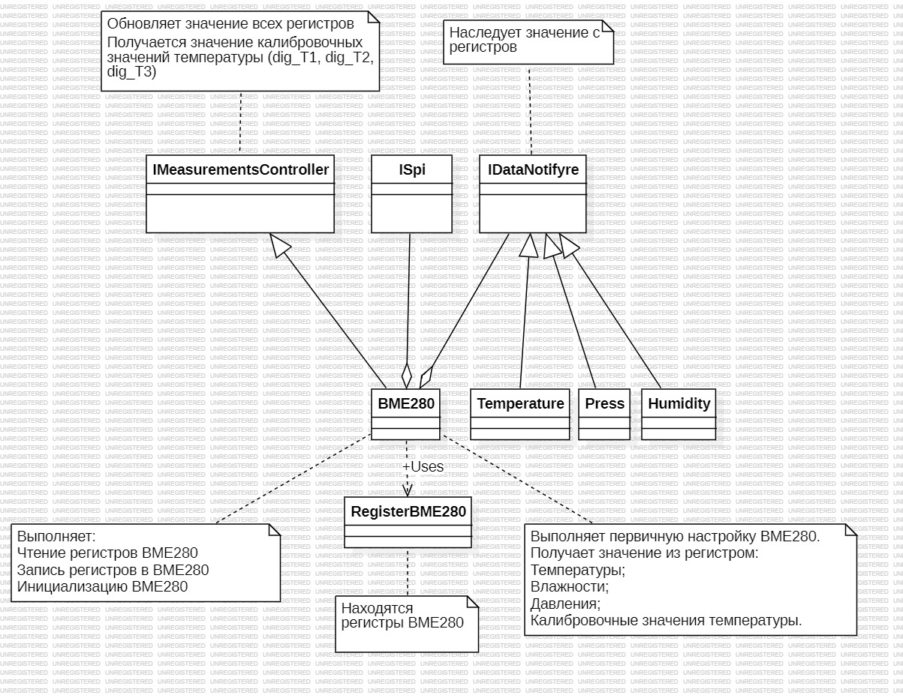

:stem:
== Описание архитектуры

.Описание блоков
[%autowidth]
|===
|Наименование|Описание
|IMeasurementsUpdate|Обспечивает обновление измеряемых параметров.
|IMeasurementsController|Обспечивает инициирование считывание кодов с регистров датчика.
|ITransfer|Обспечивает отправку данных по интерфейсу USART.
|MeasureTask|Раз в 100 мс выполняет обновление измеряемых параметров.
|SendTask|Раз в секунду выполняет передачу измеряемых параметров по USART.
|===

.Диаграмма "задачи"
image::picter/1.jpg[]

.Описание блоков
[%autowidth]
|===
|Наименование|Описание
|IFloatDataProvider|Обеспечивает возврат измеряемых параметров.
|Temperature|Выполняет преобразование значение регистра в градусы.
|СalculationDewPoint|Выполняет расчет точки росы используя значение градусов и влажности.
|Humidity|Выполняет преобразование значение регистра в влажность.
|Press|Выполняет преобразование значение регистра в давление.
|Usart|Выполняет передачу данных по USART.
|===

.Диаграмма "Обновление расчетов"
image::picter/2.jpg[]

.Описание блоков
[%autowidth]
|===
|Наименование|Описание
|IDataNotify|Обеспечивает наследование кодов с регистров.
|ISpi|Обеспечивает передачу данных по SPI.
|BME280|Выполняет настройку датчика, получает коды с регистров.
|RegisterBME280|Хранит регистры назначения датчика.
|===

.Диаграмма "Обновление регистров"
