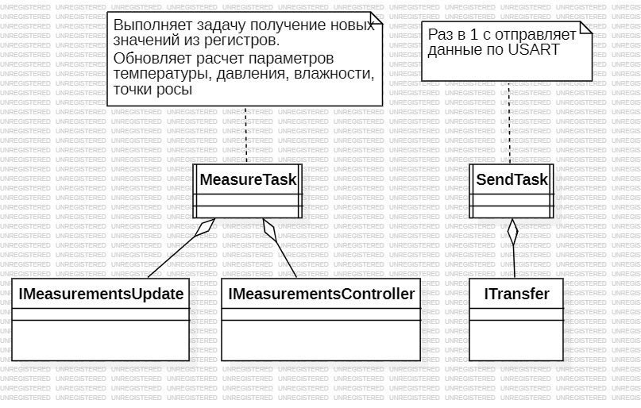
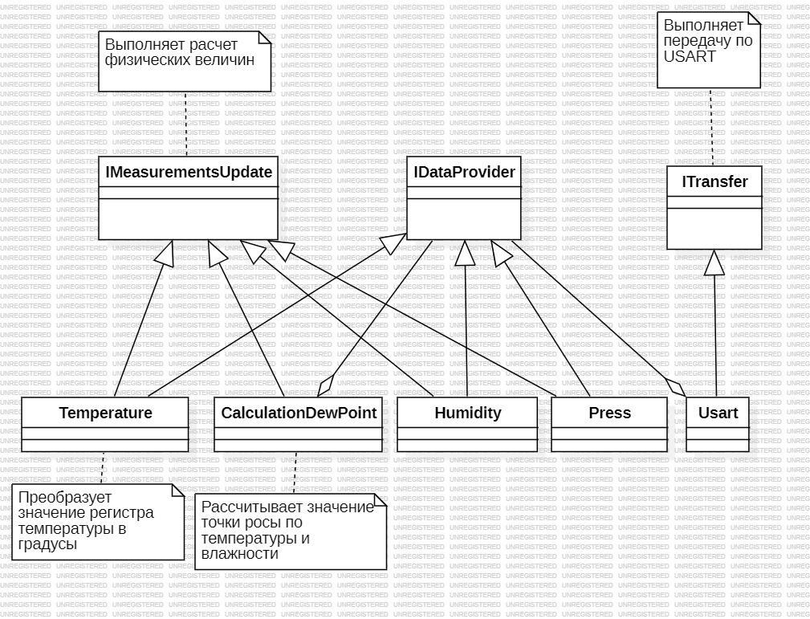

:stem:
== Описание арлитектуры

.Диаграмма "задачи"

.Описание блоков  
[%autowidth]
|===
|Наименование | Описание
|MeasureTask|Контейнер который включает в себя функции IMeasurementsUpdate и IMeasurementsController.
|SendTask|Контейнер который выполняет отправку данных по интерфейсу USART 1 раз в секунду.
|IMeasurementsUpdate|Интерфейс который реализует обновление полученных значений температуры, давления, влажности и точки росы 1  раз в 100 мс. 
|IMeasurementsController|Интерфейс который реализует обновление получаемых значений с регистров датчика  1 раз в 100 мс.
|===

.Диаграмма "Обновление расчетов"

.Описание блоков  
[%autowidth]
|===
|Наименование|Описание
|IMeasurementsParameter|интерфейс который имеет функцию  расчет параметров температуры, давления, влажности, точки росы.
|IUsart|Интерфейс который имеет функцию отправки данных по USART.
|Temperature|Класс которые выполняет расчета параметра температуры.
|СalculationDewPoint|Класс которые выполняет расчета параметра температуры, влажности и по этим параметрам высчитывает точку росы.
|Humidity|Класс которые выполняет функцию расчета параметра влажности.
|Press|Класс которые выполняет расчета параметра давления.
|Usart|Класс который выполняет отправку данных по интерфейсу USART.
|===

.Диаграмма "Обновление регистров"

.Описание блоков  
[%autowidth]
|===
|Наименование|Описание
|IDataPress|Интерфейс который имеет функцию получение значений давления с регистров датчика.
|IDewPoint|Интерфейс который имеет функцию получение значений температуры, влажности с регистров датчика.
|ISpi|Интерфейс который имеет функцию общение по SPI.
|IDataHumidity|Интерфейс который имеет функцию получение значений влажности.
|IDataCompensation|Интерфейс который имеет функцию получение калибровочных значений для температуры.
|IDataTemperature|Интерфейс который имеет функцию получение значений температуры с регистров датчика.
|Spi|Класс который выполняет общение по SPI.
|Press|Класс который хранит в себе значение с регистром давления.
|СalculationDewPoint|Класс который хранит в себе значение регистром температуры, влажности.
|Humidity|Класс который который хранит в себе значение регистром влажности.
|Temperature|Класс который который хранит в себе значение регистром температуры.
|BME280|Класс который выполняет настройку датчика, получает значение с регистров температуры, давления, влажности.
|RegisterBME280|Класс который хранит в себе необходимые регистры для настройки датчика BME280
|===