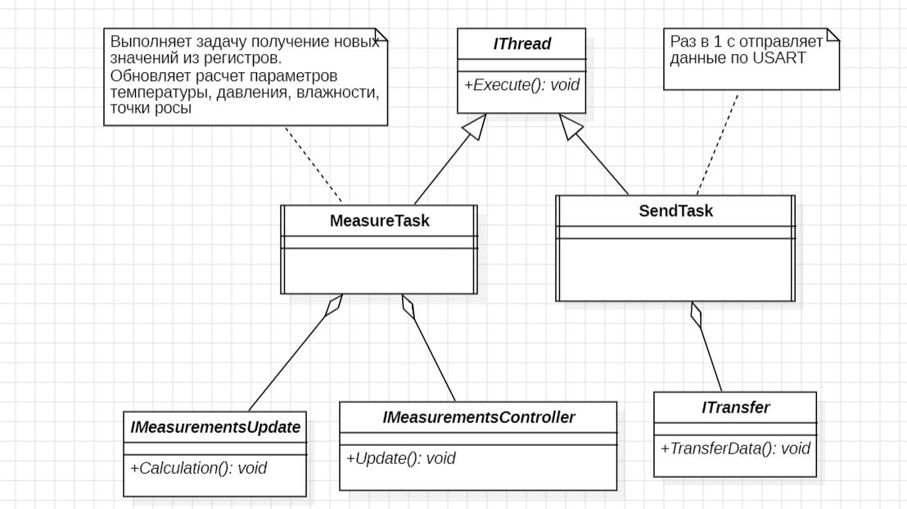

:stem:
== Описание архитектуры

.Диаграмма "задачи"

.Логика работы архитектуры
[%autowidth]
|===
|Этап|Описание
|1|Класс BME280 используя RegisterBME280 производит инициализацию датчика, передача и прием данных с датчика происходит через метод интерфейса ISpi.
|2|Класс MeasureTask с периодичностью в 100 мс получает значение регистров через интерфейс IMeasurementsController. +
IMeasurementsController обеспечивает классу BME280 возможность инициирования считывания кодов с регистров датчика. +
Далее IDataNotify получает коды данных регистров с класса BME280. +
Затем IDataNotify предоставляет классам Temperature, Humidity, Press нужные коды с регистров.
|3|Класс MeasureTask с периодичностью в 100 мс получает обновленные значения измеряемых параметров через IMeasurementsUpdate. +
IMeasurementsUpdate предоставляет метод расчета измеряемых параметров классам Temperature, Humidity, Press, СalculationDewPoint. +
Класс СalculationDewPoint через IFloatDataProvider получает измеряемые параметры температуры, влажности для расчета точки росы.
|4|Класс SendTask с периодичностью раз в секунду отправляет измеряемые параметры по USART через интерфейс ITransfer. +
ITransfer предоставляет метод передачи измеряемых параметров классу Usart. +
Usart через IFloatDataProvider получает измеряемые параметры классов Temperature, Humidity, Press, СalculationDewPoint. 
|===

.Описание блоков
[%autowidth]
|===
|Наименование|Описание
|IMeasurementsUpdate|Обспечивает обновление измеряемых параметров.
|IMeasurementsController|Обспечивает инициирование считывание кодов с регистров датчика.
|ITransfer|Обспечивает отправку данных по интерфейсу USART.
|MeasureTask|Раз в 100 мс выполняет обновление измеряемых параметров.
|SendTask|Раз в секунду выполняет передачу измеряемых параметров по USART.
|===

.Диаграмма "Обновление расчетов"
image::picter/8.png[]
.Описание блоков
[%autowidth]
|===
|Наименование|Описание
|IFloatDataProvider|Обеспечивает возврат измеряемых параметров.
|Temperature|Выполняет преобразование значение регистра в градусы.
|СalculationDewPoint|Выполняет расчет точки росы используя значение градусов и влажности.
|Humidity|Выполняет преобразование значение регистра в влажность.
|Press|Выполняет преобразование значение регистра в давление.
|Usart|Выполняет передачу данных по USART.
|===

.Диаграмма "Обновление регистров"

.Описание блоков
[%autowidth]
|===
|Наименование|Описание
|IDataNotify|Обеспечивает наследование кодов с регистров.
|ISpi|Обеспечивает передачу данных по SPI.
|BME280|Выполняет настройку датчика, получает коды с регистров.
|RegisterBME280|Хранит регистры назначения датчика.
|===
