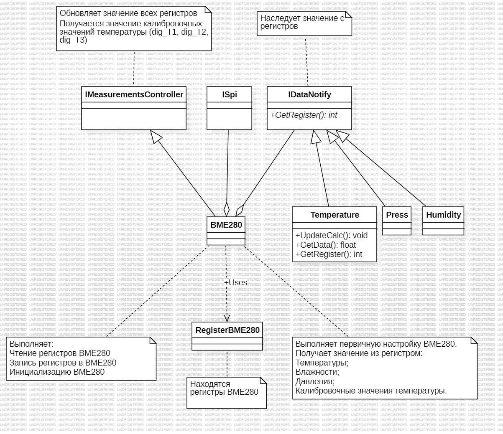

:stem:
== Описание арлитектуры

.Диаграмма "задача"
image::picter/1.jpg[]

.Описание блоков  
[%autowidth]
|===
|Наименование | Описание
|MeasureTask|Контейнер который включает в себя функции IMeasurementsUpdate и IMeasurementsController.
|IMeasurementsUpdate| Интерфейс который реализует обновление полученных значений температуры, давления, влажности и точки росы 1 раз в секунду. 
|IMeasurementsController|Интерфейс который реализует обновление получаемых значений с регистров датчика  1 раз в 100 мс.
|===

.Диаграмма "Обновление расчетов"
image::picter/2.jpg[]

.Описание блоков  
[%autowidth]
|===
|Наименование|Описание
|IMeasurementsParameter|интерфейс который имеет функцию  расчет параметров температуры, давления, влажности, точки росы.
|IUsart|Интерфейс который имеет функцию отправки данных по USART.
|Temperature|Класс которые выполняет расчета параметра температуры.
|СalculationDewPoint|Класс которые выполняет расчета параметра температуры, влажности и по этим параметрам высчитывает точку росы.
|Humidity|Класс которые выполняет функцию расчета параметра влажности.
|Press|Класс которые выполняет расчета параметра давления.
|Usart|Класс который выполняет отправку данных по интерфейсу USART.
|===

.Диаграмма "Обновление регистров"

.Описание блоков  
[%autowidth]
|===
|Наименование|Описание
|IDataPress|Интерфейс который имеет функцию получение значений давления с регистров датчика.
|IDewPoint|Интерфейс который имеет функцию получение значений температуры, влажности с регистров датчика.
|ISpi|Интерфейс который имеет функцию общение по SPI.
|IDataHumidity|
|IDataCompensation|
|IDataTemperature|
|Spi|
|Press|
|СalculationDewPoint|
|BME280|
|Humidity|
|Temperature|
|RegisterBME280|

|===