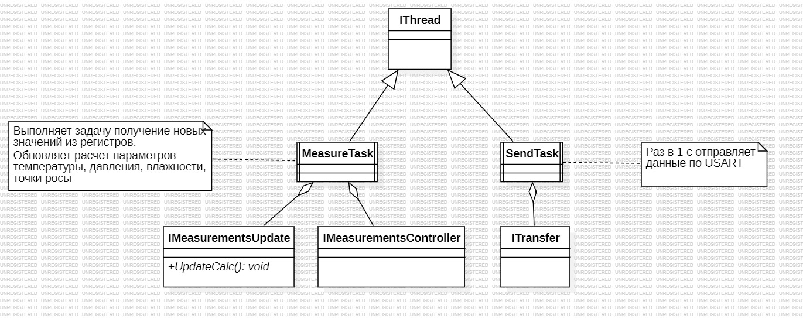
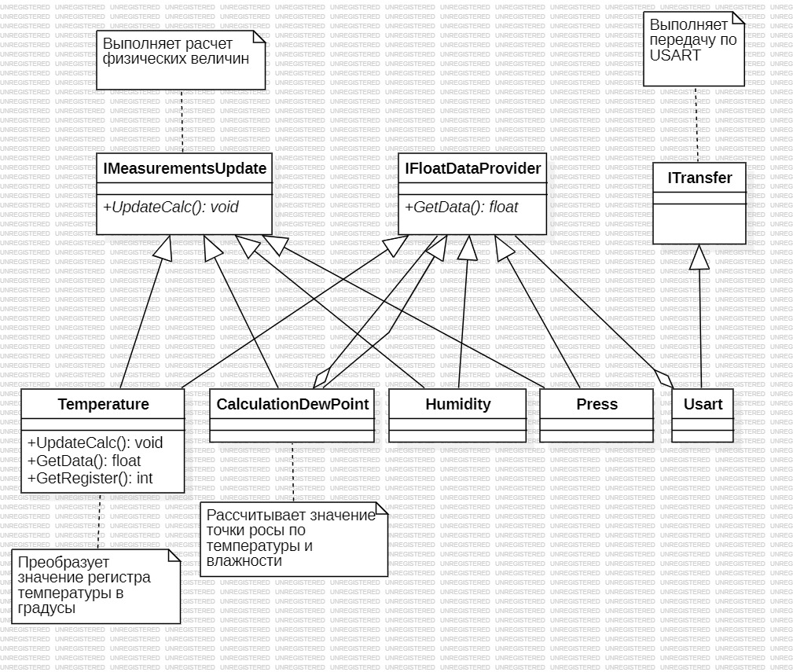

:stem:
== Описание арлитектуры

.Диаграмма "задачи"

.Описание блоков  
[%autowidth]
|===
|Наименование | Описание
|MeasureTask|Контейнер который включает в себя функции IMeasurementsUpdate и IMeasurementsController.
|SendTask|Контейнер который выполняет отправку данных по интерфейсу USART 1 раз в секунду.
|IMeasurementsUpdate|Интерфейс который реализует обновление полученных значений температуры, давления, влажности и точки росы 1  раз в 100 мс. 
|IMeasurementsController|Интерфейс который реализует обновление получаемых значений с регистров датчика  1 раз в 100 мс.
|ITransfer|Интерфейс который реализует передачу данных по USART.
|===

* Раз в 100 мс просыпается MeasureTask и вызывает обновление регистром через интерфейс IMeasurementsController, обновление расчетных значений температуры, давления, влажности происходит через интерфейс IMeasurementsUpdate

* 1 раз в секунду  просыпается задача SendTask и выполняет передачу данных используя интерфейс ITransfer

.Диаграмма "Обновление расчетов"

.Описание блоков  
[%autowidth]
|===
|Наименование|Описание
|IMeasurementsUpdate|интерфейс который имеет функцию  расчет параметров температуры, давления, влажности, точки росы.
|IDataProvider|Интерфейс который конвертирует рассчитанные данные в формат строки.
|ITransfer|Интерфейс который имеет функцию отправки данных по USART.
|Temperature|Класс которые выполняет расчета параметра температуры.
|СalculationDewPoint|Класс которые выполняет расчета параметра температуры, влажности и по этим параметрам высчитывает точку росы.
|Humidity|Класс которые выполняет функцию расчета параметра влажности.
|Press|Класс которые выполняет расчета параметра давления.
|Usart|Класс который выполняет отправку данных по интерфейсу USART.
|===

* Классы Temperature, СalculationDewPoint, Humidity, Press наследуют интерфейс IMeasurementsUpdate, по этому интерфейсу каждому классу доступны значения с регистров датчика, которые будут пересчитываться в физические величины внутри каждого класса.

* Также данные классы наследуют интерфейс IDataProvider, он выполняет конвертацию всех вычисленных данных в формат строки и передает по USART. Для передачи по USART выполнена агрегация с классом Usart, который наследует интерфейс ITransfer.

.Диаграмма "Обновление регистров"
image::picter/3.jpg[]

.Описание блоков  
[%autowidth]
|===
|Наименование|Описание
|IMeasurementsController|Интерфейс который выполняет обновление регистром и получает значение калибровочных значений температуры 
|IDataNotifyre|Интерфейс в котором выполняет сортировка значений из регистром по каждому классу, который наследуют данный интерфейс.
|ISpi|Интерфейс который выполняет общение по SPI.
|Press|Класс который хранит в себе значение с регистром давления.
|Humidity|Класс который который хранит в себе значение регистром влажности.
|Temperature|Класс который который хранит в себе значение регистром температуры.
|BME280|Класс который выполняет настройку датчика, получает значение с регистров температуры, давления, влажности.
|RegisterBME280|Класс который хранит в себе необходимые регистры для настройки датчика BME280
|===

* Класс BME280 проводит инициализацию датчика отправляя команды настройки  через интерфейс ISpi, затем через интерфейс IMeasurementsController получаем значение из регистров. Следом с помощью интерфейса IDataNotifyre производим определенный выбор данных из считанных регистров и передаем каждому классу Temperature, Press, Humidity свои значения.