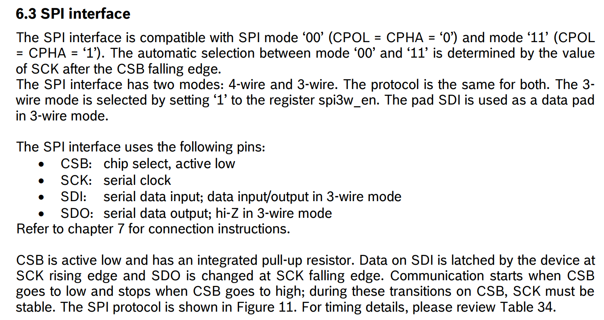
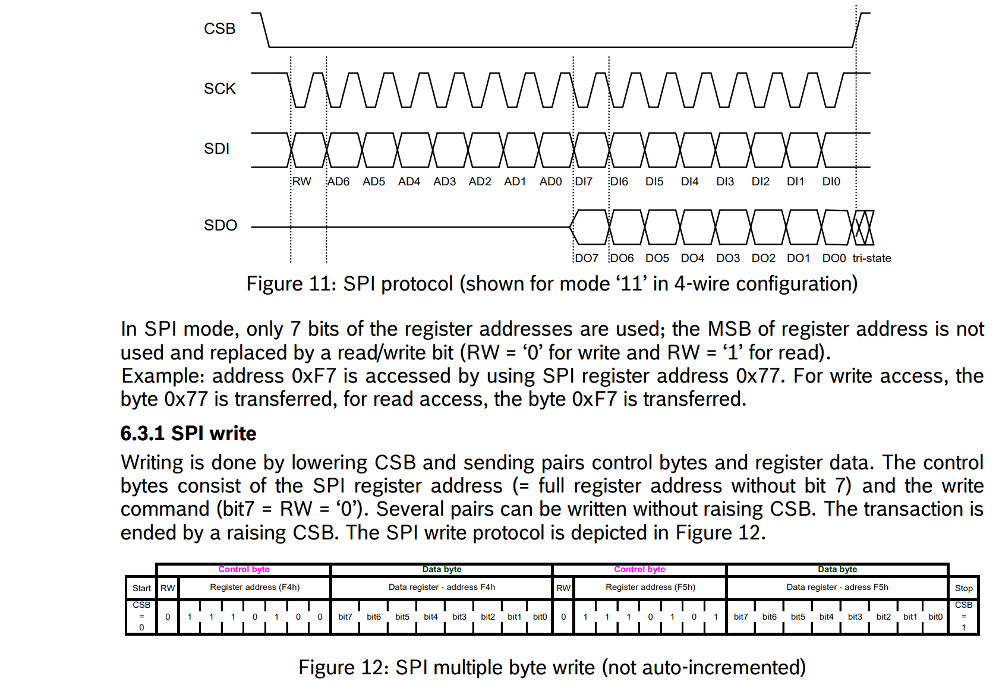
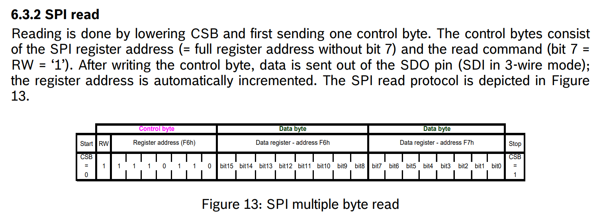
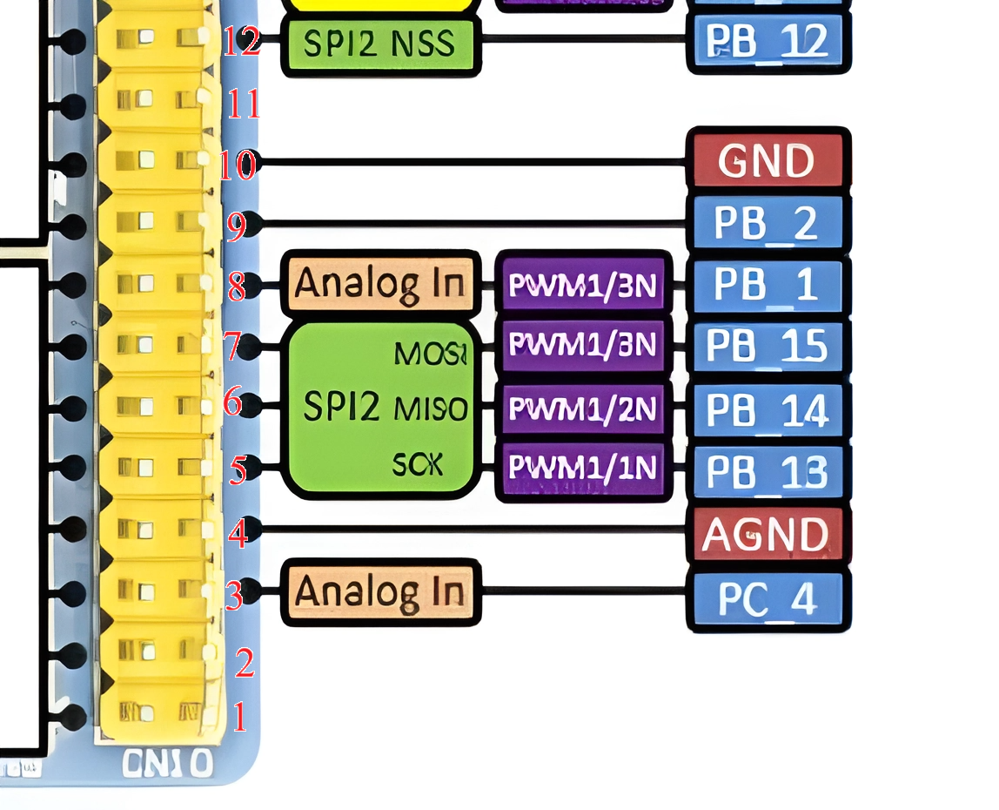
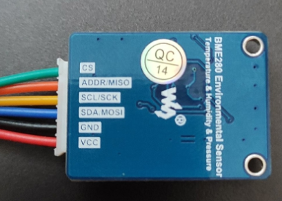
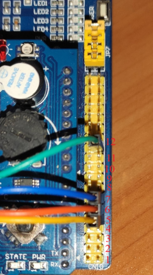
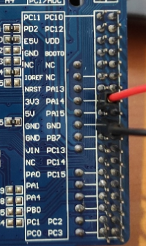

:stem:
== Подключение SPI

.Настройка SPI интерфейса

.SPI Write

.SPI Read

.Конфигурация SPI2

.Конфигурация SPI на датчике

.Подключение датчика к отладочной плате

.VCC, GND

== Настройка SPI2
[source, cpp]
----
  RCC::AHB1ENR::GPIOBEN::Enable::Set();
  RCC::APB1ENR::SPI2EN::Enable::Set();
  SPI2::CR1::MSTR::Master::Set();  
  SPI2::CR1::RXONLY::FullDuplex::Set(); 
  SPI2::CR1::DFF::Data8bit::Set();
  SPI2::CR1::CPOL::High::Set(); // 1
  SPI2::CR1::CPHA::Phase2edge::Set(); // 1
  SPI2::CR1::SSM::NssSoftwareEnable::Set(); // раз NssSoftwareEnable, то требуется самостоятельно дергать линию NSS
  SPI2::CR1::BR::PclockDiv2::Set(); // делитель
  SPI2::CR1::LSBFIRST::MsbFisrt::Set(); // формат кадра
  SPI2::CR2::FRF::MotorolaMode::Set(); // 0
  SPI2::CR1::CRCEN::CrcCalcDisable::Set(); // 0
  SPI2::CR1::SPE::Enable::Set();

  GPIOB::MODER::MODER12::Output::Set();
  GPIOB::ODR::ODR12::High::Set(); // логическая 1 на линии NSS
----

