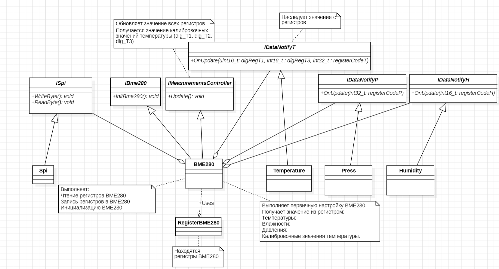

:stem:
== Подключение SPI

.Диаграмма SPI

.Настройка SPI интерфейса
image::picter4/7.png[]

* Интерфейс SPI совместим с режимом SPI «00» (CPOL = CPHA = «0») и режимом «11» (CPOL = CPHA = «1»). Автоматический выбор между режимами «00» и «11» определяется значением SCK после спадающего фронта CSB. Интерфейс SPI имеет два режима: 4-проводной и 3-проводной. Протокол одинаков для обоих. Трехпроводной режим выбирается установкой «1» в регистр spi3w_en. Панель SDI используется в качестве панели данных в 3-проводном режиме.
Интерфейс SPI использует следующие контакты:
CSB: выбор чипа, активный низкий уровень
SCK: последовательные часы
SDI: последовательный ввод данных; ввод/вывод данных в 3-проводном режиме
SDO: последовательный вывод данных; hi-Z в 3-проводном режиме

.SPI Write
image::picter4/8.png[]

* В режиме SPI используются только 7 бит адресов регистров; старший бит адреса регистра не используется и заменяется битом чтения/записи (RW = «0» для записи и RW = «1» для чтения). Пример: доступ к адресу 0xF7 осуществляется с использованием адреса регистра SPI 0x77. Для доступа на запись передается байт 0x77, для доступа на чтение передается байт 0xF7.

* Запись SPI:
Запись осуществляется понижением CSB и отправкой пар управляющих байтов и данных регистра. Байты управления состоят из адреса регистра SPI (= полный адрес регистра без бита 7) и команды записи (бит7 = RW = ‘0’). Несколько пар можно записать без поднятия CSB. Транзакция
завершилось повышением CSB.

.SPI Read
image::picter4/9.png[]

* Чтение осуществляется понижением CSB и отправкой сначала одного управляющего байта. Байты управления состоят из адреса регистра SPI (= полный адрес регистра без бита 7) и команды чтения (бит 7 = RW = ‘1’). После записи управляющего байта данные отправляются с контакта SDO (SDI в 3-проводном режиме); адрес регистра автоматически увеличивается.

.Конфигурация SPI2
image::picter4/10.jpeg[]

.Конфигурация SPI на датчике
image::picter4/11.png[]

.Подключение датчика к отладочной плате
image::picter4/12.png[]

.VCC, GND
image::picter4/13.png[]

