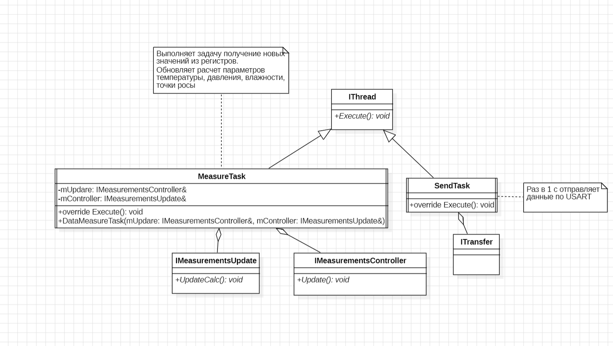

:stem:
== Описание классов MeasureTask, BME280

.Диаграмма "MeasureTask"

* Данный класс имеет переменную mController  в которую через агрегацию интерфейса IMeasurementsController, передается метод Update() - данный метод вызывает обновление данных с регистров.

* Данный класс имеет переменную mUpdare  в которую через агрегацию интерфейса IMeasurementsUpdate, передается метод UpdateCalc() - данный метод вызывает обновление расчетных данных.

.Диаграмма "MeasureTask"
image::picter2/2.png[]

Данный класс имеет 7 переменных:
* registerCodeT - регистр откуда будут записываться данные температуры

* registerCodeH - регистр откуда будут записываться данные влажности

* registerCodeP - регистр откуда будут записываться данные давления

* dig_T1,dig_T3 - регистры откуда будут записываться данные калибровочных значений температуры

* bmeOn - через агрегацию интерфейса IDataNotify переменная сигнализирует о готовности полученных значений кодов с датчика.

* spi - через агрегацию интерфейса ISpi, передается метод ModeWrite(), ModeRead(), Delay().
