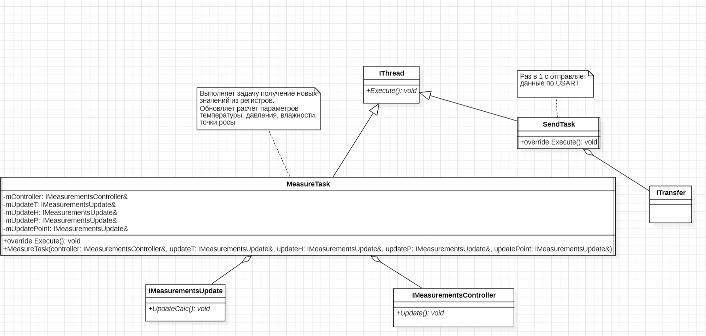

:stem:
== Заполнение классов MeasureTask, BME280, Temperature

.Диаграмма "MeasureTask"

* Данный класс имеет переменную mController  в которую через агрегацию интерфейса IMeasurementsController, передается метод Update() - данный метод вызывает обновление данных с регистров.

* Данный класс имеет переменную mUpdate  в которую через агрегацию интерфейса IMeasurementsUpdate, передается метод UpdateCalc() - данный метод вызывает обновление расчетных данных.

.Лисинг интерфейса IMeasurementsController
[source, cpp]
----
#ifndef IMEASUREMENTSCONTRILLER
#define IMEASUREMENTSCONTRILLER

class IMeasurementsController
{
public:
  virtual void Update () = 0;
  
  
private:
};
#endif
----

.Лисинг интерфейса IMeasurementsUpdate
[source, cpp]
----
#ifndef IMEASUREMENTSUPDATE
#define IMEASUREMENTSUPDATE

class IMeasurementsUpdate 
{
public: 
  
  virtual void UpdateCalc() = 0;

};
#endif
----

.Лисинг класса MeasureTask
[source, cpp]
----
#ifndef MEASURETASK
#define MEASURETASK

#include "thread.hpp" // for OsWrapper::Thread<>
#include "imeasurementscontroller.h" // for update register

class MeasureTask: public OsWrapper::Thread<128> 
{
public:
  MeasureTask(IMeasurementsController& controller, IMeasurementsUpdate& update) : mController(controller), mUpdate(mUpdate) {}
  
  void Execute() override 
  {
    for (;;) 
    {
      mController.Update();
      mUpdate.UpdateCalc();
      Sleep(100ms);
    }
  
  }
private:
  IMeasurementsController& mController;
  IMeasurementsUpdate& mUpdate;

};
#endif
----

.Окружение класса "BME280"
image::picter2/2.png[]

.Переменные класса
[%autowidth]
|===
|Наименование|Описание
|digRegT1|переменная куда будут записываться данные калибровочных значений температуры
|digRegT3|переменная куда будут записываться данные калибровочных значений температуры
|registerCodeT|переменная куда будут записываться данные с регистра температуры
|registerCodeP|переменная куда будут записываться данные с регистра давления
|registerCodeH|переменная куда будут записываться данные с регистра влажности
|===

.Лисинг интерфейса ISpi
[source, cpp]
----
#ifndef ISPI
#define ISPI

class ISpi
{
public:
  virtual void ModeWrite(uint8_t reg) = 0;
  virtual void ModeRead(uint8_t reg) = 0;
};
#endif
----

.Лисинг интерфейса IDataNotifyT
[source, cpp]
----
#ifndef IDATANOTIFYT
#define IDATANOTIFYT

class IDataNotifyT
{
public:
  virtual void OnUpdate(int32_t CodeRegisters, uint16_t TempRegister1, int16_t TempRegister3) = 0;
};
#endif
----  

.Лисинг класса Spi
[source, cpp]
----
#ifndef SPI
#define SPI
#include "ispi.h"
#include "spi2registers.hpp" // for SPI2
#include "gpiobregisters.hpp"  // for GPIOB
class Spi: public ISpi 
{
public:
  void ModeWrite(uint8_t reg) override 
  {
    reg = (reg & 0x7f);
    GPIOB::ODR::ODR12::Low::Set();
    SPI2::DR::Write(reg);
  }
  
  void ModeRead(uint8_t reg) override 
  {
    GPIOB::ODR::ODR12::Low::Set();
    SPI2::DR::Write(reg);
  }
};

#endif
----

.Лисинг класса Bme280
[source, cpp]
----
#ifndef BME280
#define BME280

#include "imeasurementscontroller.h"
#include "ispi.h"
#include "spi2registers.hpp"
#include "idatanotifyt.h"
#include "idatanotifyp.h"
#include "idatanotifyh.h"

class Bme280: public IMeasurementsController
{
  
public:
  Bme280(ISpi& spi, IDataNotifyT& dataT, IDataNotifyP& dataP, IDataNotifyH& dataH) : mspi(spi), mdataT(dataT), mdataP(dataP), mdataH(dataH) {}
  void Update() override 
  {
    mspi.ModeRead(BME280_REGISTER_DIG_T1);
    digRegT1 = SPI2::DR::Get();
    GPIOB::ODR::ODR12::High::Set();
    
    mspi.ModeRead(BME280_REGISTER_DIG_T3);
    digRegT3 = SPI2::DR::Get();
    GPIOB::ODR::ODR12::High::Set();
    
    mspi.ModeRead(BME280_REGISTER_TEMPDATA);
    registerCodeT = SPI2::DR::Get();
    GPIOB::ODR::ODR12::High::Set();
    
    mspi.ModeRead(BME280_REGISTER_PRESS);
    registerCodeP = SPI2::DR::Get();
    GPIOB::ODR::ODR12::High::Set();
    
    mspi.ModeRead(BME280_REGISTER_HUMIDDATA);
    registerCodeH = SPI2::DR::Get();
    GPIOB::ODR::ODR12::High::Set();
    
    mdataT.OnUpdate(registerCodeT, digRegT1, digRegT3);
    
    mdataP.OnUpdate(registerCodeP);
    
    mdataH.OnUpdate(registerCodeH);
    
    
  }
  
  

private:
  uint16_t digRegT1;
  int16_t digRegT3;
  int32_t registerCodeT;
  int32_t registerCodeP;
  int16_t registerCodeH;
  
  ISpi& mspi;
  
  IDataNotifyT& mdataT;
  
  IDataNotifyP& mdataP;
  
  IDataNotifyH& mdataH;
  
};
#endif
----

.Лисинг класса Temperature
[source, cpp]
----
#ifndef TEMPERATURE
#define TEMPERATURE

#include "idatanotifyt.h"

class Temperature: public IFloatDataProvider, public IMeasurementsUpdate, public IDataNotifyT
{
  public:
  

  void UpdateCalc() override  // for IMeasurementsUpdate
  {
    measuredX = ((adcT / 16) - digT1);
    measuredT = measuredX * digT1 + ((measuredX * measuredX * digT3) / 65536);
    measuredT = measuredT / 1024;
  }
    
  void  OnUpdate(int32_t CodeRegisters, uint16_t TempRegister1, int16_t TempRegister3)  override  // for IDataNotifyT
  {
    adcT = CodeRegisters;
    
    digT1 = TempRegister1;
    
    digT3 = TempRegister3;
  }
    
  float GetData() override  // for IFloatDataProvider
  {
    
  }  
private:
  float measuredX;
  float measuredT;
  uint16_t digT1;
  int16_t digT3;
  int32_t adcT; 
};
#endif
----