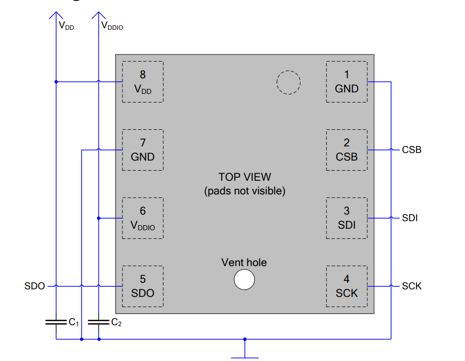
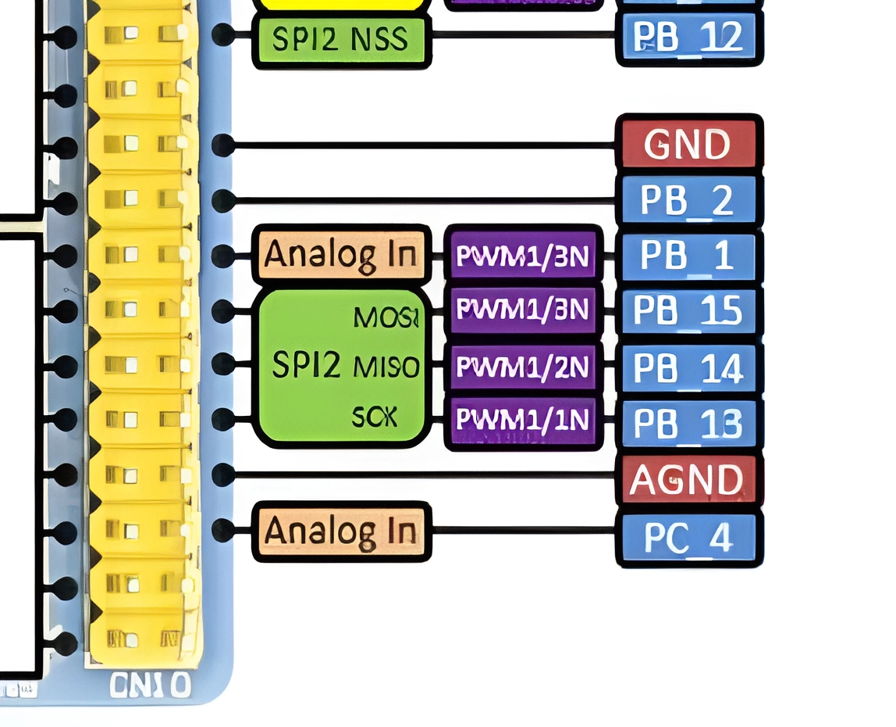
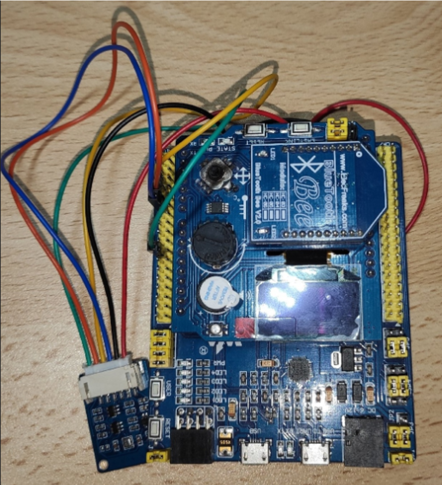
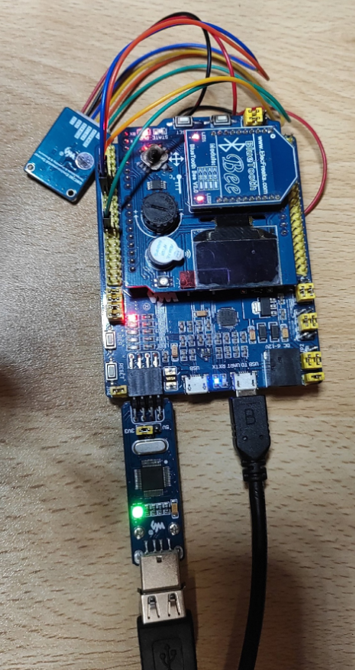
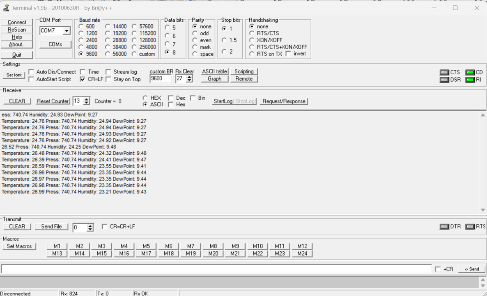

:stem:
:toc: macro 

[.text-center]
Министерство науки и высшего образования Российской Федерации +
Федеральное государственное автономное образовательное учреждение +
высшего образования «Южно-Уральский государственный университет» +
(национальный исследовательский университет) +
Высшая школа электроники и компьютерных наук +
Кафедра «Информационно-измерительная техника»

[.text-center]
дисциплина: 1.Ф.П1.06 (Программное обеспечение измерительных процессов)

[.text-center]
Анализ требований

[.text-right]
Работу принял, доцент +
______/ С.В. Колодий / +
______2024 г.

[.text-right]
Автор работы +
студент группы КЭ-413 +
______/ А.С. Нежурбида / +
______2024 г.

[.text-center]
Челябинск 2024

include::Курсовой вариант 1.adoc[]

== Оглавление

toc::[]

== Введение
Микроконтроллер – микросхема, предназначенная для управления различными техническими объектами от бытовых приборов до промышленного оборудования. Типичный микроконтроллер содержит на одном кристалле процессор, ОЗУ, ПЗУ и периферийные компоненты: устройства ввода-вывода, таймеры и др. По сути, микроконтроллер – это однокристальный компьютер, способный выполнять относительно простые задачи [1, с. 7].
Задачи работы:
1)	разработать программное обеспечение;
2)	Проверка работоспособности устройства.

== Окружение программы

.Окружение программы
image::picter/1.png[]
.Параметры датчика 
[%autowidth]
|===
|Наименование | Описание

|BME280| Высокоточный метеодатчик, измеряющий такие параметры микроклимата как температура, влажность и атмосферное давление. В зависимости от модуля может подключаться к I2C и SPI шинами микроконтроллера и работать от 3-5V, если на плате есть стабилизатор, или 3V, если его нет. В данном случае датчик подключен к питанию 3.3 V

|STM32|  это отладочная плата, которая позволит изучить возможности микроконтроллера STM32F411RET6 на базе ядра Cortex-M4, режим DMA использует little-endian.
|BlueTooth Bee HC-06| Беспроводной модуль для приема/передачи данных по протоколу Bluetooth. Особенности: - Поддерживает работу с протоколом связи UART, Bluetooth 2.0; - Скорость передачи данных: 9600 бит/сек; - Встроенная антенна; - Радиус действия до 10 метров.
|===

== BME280

.Параметры датчика
[%autowidth]
|===
|Измеряемые физические величины | Система единиц |Регистры, где находятся необработанные выходные данные| объем данных, бит

| Давление | паскаль | 0xF7 - 0xF9  | 20 
| Температура | градусы цельсия | 0xFA - 0xFC  | 20 
| Влажность | % | 0xFD - 0xFE |  16 
|===

.Регистры настройки сбора данных
[%autowidth]
|===
|Регистр|Описание
|0xF4|Данные регистр используется для управления передискретизацией данных температуры и давления
|0xF2|Данные регистр используется для управления передискретизацией данных влажности
|===

link:https://kurl.ru/kxTMB[], с 26, 27, 29, 30.

.Регистры необходимые для настройки датчика
[%autowidth]
|===
|Регистр | Описание | Страница в документации link:https://kurl.ru/kxTMB[]

| 0x76| Адрес BME280 | 32

| 0xD0| ID регистр BME280 | 26

| 0x60| Информация, читаемая от BME280 в ID регистре | 26

| 0xE0| Регистр для перезагрузки BME280 | 26

| 0xB6| Значение, записываемое в регистр для перезагрузки BME280 | 26

| 0xF3| Регистр статуса BME280 | 26

| 0xF5| Регистр конфигурации BME280, задаём время ожидания, значение постоянной времени
фильтра BME280 | 28
|===

* Выход BME280 состоит из выходных значений АЦП. Однако каждый чувствительный элемент ведет себя по-разному. Поэтому фактическое давление и температуру необходимо рассчитывать с использованием набора калибровочных параметров link:https://kurl.ru/kxTMB[], с 21, (4.2 Output compensation) .

.Регистры калибровки
[%autowidth]
|===

|Адрес регистра|Обозначение регистра|Тип данных

|0x88 - 0x89|dig_T1|unsigned short

|0x8A - 0x8B|dig_T2|signed short

|0x8C - 0x8D|dig_T3|signed short
|===

* dig_T - Обозначение регистра откуда читаем калибровочное значение температуры

* Все данные передаются младшим байтом в перед, по этому будет необходима функция перестановки байтов

.Преобразование температуры
stem:[X = ((adc__T) / 16) - dig__T1] 

* гдe adc_T — значение температуры полученное из регистра 

stem:[(T__f) = (X*dig__T1 + ((X^2*dig__T3)/65536))/1024]

* гдe T_f — конечное значение температуры

.Преобразование давления
stem:[D__F = ((adc__D ) / 16) * 0,18] 

* гдe adc_D — значение давления полученное из регистра 

* D_F — конечное значение давления

.Преобразование Влажности
stem:[H__F = (adc__H) * 0,008] 

* гдe adc_H — значение влажности полученное из регистра 

* H_F — конечное значение влажности

.Вычисление точки росы

* Точка росы - рассчитываемый параметр, для этого воспользуемся формулой:

stem:[Tp = ((b * y(T,Q)) / (a - y(T,Q)) )] +
гдe T — температура в °C +
Q - относительная влажность в объёмных долях +
a = 17,27 +
b = 237,7 °C +
stem:[y(T,Q) = (a * T) / (b + T ) + ln Q]

* Период измерения физических вилечин составляет 100 мс.

* В BME280 предусмотрен БИХ-фильтр, для более точных измерений он будет включен.

* Общение с датчиком осуществляться по интерфейсу SPI2.

* Объёмная доля - безразмерная величина, она выражается числом от 0 до 1, где 1 - является 100 %.

* Выбор интерфейса осуществляется автоматически на основе статуса CSB (выбор чипа), если CSB отключен, активируется интерфейс SPI.  

.Схема подключения 4-проводного SPI

* CSB - NSS (выбор кристалла).

* SDI - MISO. 

* SDO - MOSI.

== плата Accessories Shield & BlueTooth Bee HC-06 

.Подключение линий данных USART2
[%autowidth]
|===
| Наименование линий на STM| Пин на плате STM| Наименование линий на BlueTooth Bee HC-06  

| RX_STM | PD5 | TX_HC06 

| TX_STM | PD6 | RX_HC06
|===

== Настройка SPI2 STM32F411RE

.Конфигурация линий SPI2
[%autowidth]
|===
| Пин| Наименование линии  

| PB12 | NSS

| PB13 |SCK

| PB14 | MISO

| PB15 | MOSI
|===

.Нахождение пинов SPI2 на плате

|===
| Байты отправляемы по MOSI| Описание  

| 0x77 | команда на запись
| 0xF7 | команда на чтение
|===

.Регистры необходимые для настройки SPI2
[%autowidth]
|===
| Поля регистра SPI_CR1 | Описание | Состояния  
|SPE|включение SPI|1 -  Периферийное устройство включено.
|MSTR|Выбор мастера| 1 - Master конфигурация.
|DFF|формат кадра данных | 0 -для передачи/приема выбран 8-битный формат кадра данных.
|BR|Контроль скорости передачи данных|000 -  fPCLK/2
|CPOL,CPHA| программнно выбираются четыре варианта отношений таймингов интерфейса SPI|0
|===
Страница в документации для регистров SPI link:https://kurl.ru/cWNNf[], с 601

[%autowidth]
|===
| Поля регистра SPI_DR | Описание  
|DR|Регистр данных разделен на 2 буфера: один для записи (Transmit Buffer), другой для записи.
чтение (Receive buffer)|
|===

[%autowidth]
|===
| Поля регистра SPI_SR | Описание | Состояния 
|BSY|флаг занятости.|0 - SPI не занят. 1 - SPI занят связью или буфер Tx не пуст.
|TXE|буфер передачи пуст.|0 - буфер передачи не пуст. 1 - буфер передачи пуст
|===

*  CPOL,CPHA устанавливаются в 0, так как интерфейс  SPI датчик BME280 совместим с режимом CPOL = CPHA = 0.

.Настройка скорости SPI
Для настройки скорости SPI требуется придерживаться временной диаграммы интерфейса SPI датчика BME280

.Временная диаграмма SPI
image::picter/2.png[]

.Тайминги SPI
[%autowidth]
|===
| Параметр | Краткое обозначение | Min | Max | Единица измерения

|Входная тактовая частота SPI|F_spi|0|10| МГц

|Низкий импульс SCK|T_low_sck |20 || нс

|Высокий импульс SCK|T_high_sck|20||нс

|Время установки SDI|T_setup_sdi|20||нс

|Время удержания SDI|T_hold_sdi|20||нс

|Задержка выхода SDO|T_delay_sdo, VDDIO = 1.6 V min||30|нс

|Задержка выхода SDO|T_delay_sdo, VDDIO = 1.2 V min||40|нс

|Время установки CSB|T_setup_csb|20||нс

|Время удержания CSB|T_hold_csb |20||нс
|===

* Рассчитаем полный временной тайминг T_ALL
stem:[T__All = T__low__sck + T__high__sck + T__setup__sdi + T__hold__sdi + T__delay__sdo + T__setup__csb + T__hold__csb = 150 нс]
* Переведем из временного интервала в частоту, используя условия 1 Гц = 1 цикл/с, следовательно

stem:[Frequency = 1/(T__All)]

stem:[Frequency = 6'666'666,6667]

* Нельзя устанавливать частоту работы SPI > Frequency, следовательно установим тактовую частоту генератора STM32 на 16 МГц и в регистре SPI установить значение 1 в бит BR, что даст частоту в 4,0 МГц на интерфейсе SPI2.

== Настройка USART2 STM32F411RE

. Подключить USART к источнику тактирования – устанавливаем бит USART2EN в регистре APB1ENR.​

. Настроить порты, на альтернативную функцию нужного модуля USART2​.

. Настроить формат передачи байт, с помощью регистра CR1 и CR2​.

. Задать скорость передачи с помощью регистра BRR, установить значение 800U

. Включить сам модуль USART2 битом UE в регистре CR1​.

. Разрешить глобальное прерывание для нужного USART, в регистре ISER[1] модуля NVIC, настроив на время равное 1 с​.

. Настроить порты PORT PD5 как TX, Port PD6 как RX на альтернативную функцию работы с UART в режим Push-Pull(двухтактный выход) + Pull Up(подтяжка к 1)​

Настроить USART2 на скорость 9600 бит/c, 1 стоп бит, 1 старт бит, без проверки четности, режим дискретизации 1/16, 8 бит данных.

include::DescriptionDiagram.adoc[]

include::DiagramBme280.adoc[]

include::DescriptionPhysicalValues.adoc[]

include::DescriptionSPI.adoc[]

include::DescriptionSendTask.adoc[]

== Заключение

. В ходе работы разработана архитектура программного обеспечения в виде диаграммы UML.

. Разработан код программного обеспечения, на основании диаграммы UML, где выполняются измерение давления, влажности и температуры и рассчитывается значение точки росы. Период измерения составляет 100 мс. Период вывода информации через USART2 составляет 1 секунду.

.Система в сборе

.Подключение провода для проверки системы в программе Terminal1_9_b

.Получение данных с отладочной платы
