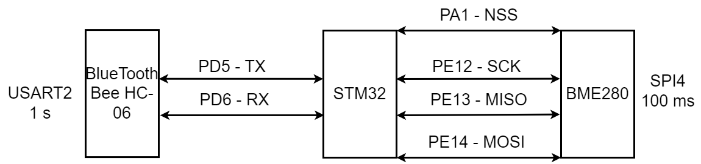
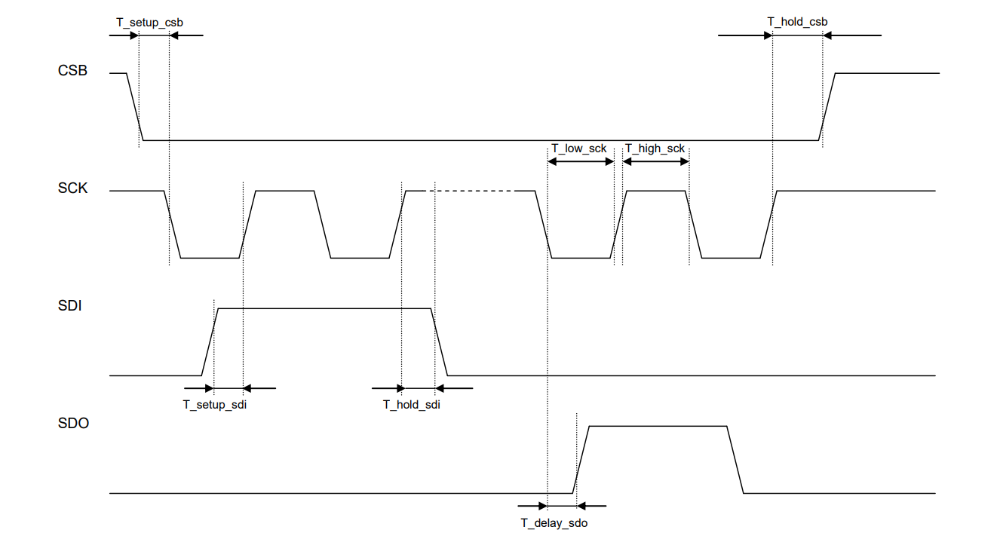
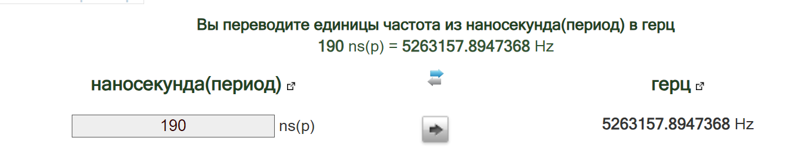

:stem:
== Окружение программы
.Окружение программы

.Параметры датчика 
[%autowidth]
|===
|Наименование | Описание

|BME280| Высокоточный метеодатчик, измеряющий такие параметры микроклимата как температура, влажность и атмосферное давление. В зависимости от модуля может подключаться к I2C и SPI шинами микроконтроллера и работать от 3-5V, если на плате есть стабилизатор, или 3V, если его нет. В данном случае датчик подключен к питанию 3.3 V

|STM32|  это отладочная плата, которая позволит изучить возможности микроконтроллера STM32F411RET6 на базе ядра Cortex-M4.
|BlueTooth Bee HC-06| Беспроводной модуль для приема/передачи данных по протоколу Bluetooth. Особенности: - Поддерживает работу с протоколом связи UART, Bluetooth 2.0; - Скорость передачи данных: 9600 бит/сек; - Встроенная антенна; - Радиус действия до 10 метров.

|===

== BME280

.Параметры датчика
[%autowidth]
|===
|Измеряемые физические величины | Система единиц |Регистры, где находятся необработанные выходные данные|Регистры, которые устанавливают параметры сбора данных| объем данных, бит

| Давление | паскаль | 0xF7 - 0xF9 | 0xF4 | 20 
| Температура | градусы цельсия | 0xFA - 0xFC | 0xF4 | 20 
| Влажность | % | 0xFD - 0xFE | 0xF2 | 16 

|===
link:https://kurl.ru/kxTMB[], с 26, 27, 29, 30.

.Преобразование температуры
[source.cpp]
----
BME280_S32_t t_fine;
BME280_S32_t BME280_compensate_T_int32(BME280_S32_t adc_T)
{
BME280_S32_t var1, var2, T;
var1 = ((((adc_T>>3) – ((BME280_S32_t)dig_T1<<1))) * ((BME280_S32_t)dig_T2)) >> 11;
var2 = (((((adc_T>>4) – ((BME280_S32_t)dig_T1)) * ((adc_T>>4) – ((BME280_S32_t)dig_T1))) >> 12) *
((BME280_S32_t)dig_T3)) >> 14;
t_fine = var1 + var2;
T = (t_fine * 5 + 128) >> 8;
return T;
}
----

.Преобразование давления 
[source]
----
BME280_U32_t BME280_compensate_P_int64(BME280_S32_t adc_P)
{
BME280_S64_t var1, var2, p;
var1 = ((BME280_S64_t)t_fine) – 128000;
var2 = var1 * var1 * (BME280_S64_t)dig_P6;
var2 = var2 + ((var1*(BME280_S64_t)dig_P5)<<17);
var2 = var2 + (((BME280_S64_t)dig_P4)<<35);
var1 = ((var1 * var1 * (BME280_S64_t)dig_P3)>>8) + ((var1 * (BME280_S64_t)dig_P2)<<12);
var1 = (((((BME280_S64_t)1)<<47)+var1))*((BME280_S64_t)dig_P1)>>33;
if (var1 == 0)
{
return 0; // avoid exception caused by division by zero
}
p = 1048576-adc_P;
p = (((p<<31)-var2)*3125)/var1;
var1 = (((BME280_S64_t)dig_P9) * (p>>13) * (p>>13)) >> 25;
var2 = (((BME280_S64_t)dig_P8) * p) >> 19;
p = ((p + var1 + var2) >> 8) + (((BME280_S64_t)dig_P7)<<4);
p = p * 0,007501; // перевод из па в мм. рт. ст., так как 1 па = 0,007501 мм.рт.ст
return (BME280_U32_t)p;
}
----

.Преобразование влажности 
[source]
----
BME280_U32_t bme280_compensate_H_int32(BME280_S32_t adc_H)
{
BME280_S32_t v_x1_u32r;
v_x1_u32r = (t_fine – ((BME280_S32_t)76800));
v_x1_u32r = (((((adc_H << 14) – (((BME280_S32_t)dig_H4) << 20) – (((BME280_S32_t)dig_H5) * v_x1_u32r)) +
((BME280_S32_t)16384)) >> 15) * (((((((v_x1_u32r * ((BME280_S32_t)dig_H6)) >> 10) * (((v_x1_u32r *
((BME280_S32_t)dig_H3)) >> 11) + ((BME280_S32_t)32768))) >> 10) + ((BME280_S32_t)2097152)) *
((BME280_S32_t)dig_H2) + 8192) >> 14));
v_x1_u32r = (v_x1_u32r – (((((v_x1_u32r >> 15) * (v_x1_u32r >> 15)) >> 7) * ((BME280_S32_t)dig_H1)) >> 4));
v_x1_u32r = (v_x1_u32r < 0 ? 0 : v_x1_u32r);
v_x1_u32r = (v_x1_u32r > 419430400 ? 419430400 : v_x1_u32r);
return (BME280_U32_t)(v_x1_u32r>>12);
}
----

.Вычисление точки росы

* Точка росы - рассчитываемый параметр, для этого воспользуемся формулой:

stem:[Tp = ((b * y(T,Q)) / (a - y(T,Q)) )] +
гдe T — температура в °C +
Q - относительная влажность в объёмных долях +
a = 17,27 +
b = 237,7 °C +
stem:[y(T,Q) = (a * T) / (b + T ) + ln Q]

* Период измерения физических вилечин составляет 100 мс.

* В BME280 предусмотрен БИХ-фильтр, для более точных измерений он будет включен.

* Общение с датчиком осуществляться по интерфейсу SPI4 (SPI_CR4).

.Регистры необходимые для настройки датчика
[%autowidth]
|===
|Регистр | Описание | Страница в документации link:https://kurl.ru/kxTMB[]

| 0x76| Адрес BME280 | 32

| 0xD0| ID регистр BME280 | 26

| 0x60| Информация, читаемая от BME280 в ID регистре | 26

| 0xE0| Регистр для перезагрузки BME280 | 26

| 0xB6| Значение, записываемое в регистр для перезагрузки BME280 | 26

| 0xF3| Регистр статуса BME280 | 26

| 0x88, 0x8A, 0x8C| Регистр, откуда читаем калибровочное значение температуры | 22, 23

| 0xA1, 0xE1, 0xE3, 0xE4, 0xE5, 0xE7| Регистр, откуда читаем калибровочное значение влажности | 22, 23

| 0x8E, 0x90, 0x92, 0x94, 0x96, 0x98, 0x9A, 0x9C, 0x9E| Регистр, откуда читаем калибровочное значение давления |22, 23

| 0xF5| Регистр конфигурации BME280, задаём время ожидания, значение постоянной времени
фильтра BME280 | 28
|===

* Выход BME280 состоит из выходных значений АЦП. Однако каждый чувствительный элемент ведет себя по-разному. Поэтому фактическое давление и температуру необходимо рассчитывать с использованием набора калибровочных параметров link:https://kurl.ru/kxTMB[], с 21, (4.2 Output compensation) .

* Все данные передаются младшим байтом в перед, по этому будет необходима функция перестановки байтов

* Выбор интерфейса осуществляется автоматически на основе статуса CSB (выбор чипа). Если CSB подключен к VDDIO, интерфейс I²C активен. Если CSB отключен, активируется интерфейс SPI.

== плата Accessories Shield & BlueTooth Bee HC-06 

.Подключение линий данных
[%autowidth]
|===
| Наименование линий на STM| Пин на плате STM| Наименование линий на BlueTooth Bee HC-06  

| RX_STM | PD5 | TX_HC06 

| TX_STM | PD6 | RX_HC06
|===

== Настройка SPI4 STM32F411RE

.Конфигурация линий SPI4
[%autowidth]
|===
| Пин| Наименование линии  

| PA1 | NSS

| PE12 |SCK

| PE13 | MISO

| PE14 | MOSI
|===

|===
| Биты отправляемы по MOSI| Описание  

| 0x77 | команда на запись
| 0xF7 | команда на чтение
|===

.Регистры необходимые для настройки SPI4
[%autowidth]
|===
| Бит| Описание | Состояния  
| DFF | формат кадра данных | 0 -для передачи/приема выбран 8-битный формат кадра данных.

1 - для передачи/приема выбран 16-битный формат кадра данных.

| LSBFIRST | формат кадра | 0 - старший бит передается первым.

1 -  младший бит передается первым.

|SPE | включение SPI| 0 - Периферийное устройство отключено.

1 -  Периферийное устройство включено.

| BR[2:0] | контроль скорости передачи данных |

000 - fPCLK/2.

001 - fPCLK/4.

010 - fPCLK/8.

011 - fPCLK/16.

100 - fPCLK/32.

101 - fPCLK/64.

110 - fPCLK/128.

111 - fPCLK/256.

| MSTR | выбор ведущего устройства | 0 - Конфигурация подчиненного устройства.

1 - Основная конфигурация.
|===
Страница в документации для регистров SPI link:https://kurl.ru/cWNNf[], с 601

.Настройка скорости SPI
Для настройки скорости SPI требуется придерживаться временной диаграммы интерфейса SPI датчика BME280

.Временная диаграмма SPI

.Тайминги SPI
[%autowidth]
|===
| Параметр | Краткое обозначение | Min | Max | Единица измерения

|Входная тактовая частота SPI|F_spi|0|10| МГц

|Низкий импульс SCK|T_low_sck |20 || нс

|Высокий импульс SCK|T_high_sck|20||нс

|Время установки SDI|T_setup_sdi|20||нс

|Время удержания SDI|T_hold_sdi|20||нс

|Задержка выхода SDO|T_delay_sdo||30|нс

|Задержка выхода SDO|T_delay_sdo||40|нс

|Время установки CSB|T_setup_csb|20||нс

|Время удержания CSB|T_hold_csb |20||нс
|===

* Полная временная диаграмма займет 190 нс

.Перевод 190 нс в частоту

* Следовательно можно установить тактовую частоту генератора на 11 МГц и в регистре SPI установить значение 0 в бит BR, что даст частоту в 5,5 МГц на итерфейсе SPI4.

== Настройка USART2 STM32F411RE

. Подключить USART к источнику тактирования – устанавливаем бит USART2EN в регистре APB1ENR.​

. Настроить порты, на альтернативную функцию нужного модуля USART2​.

. Настроить формат передачи байт, с помощью регистра CR1 и CR2​.

. Задать скорость передачи с помощью регистра BRR

. Включить сам модуль USART2 битом UE в регистре CR1​.

. Разрешить глобальное прерывание для нужного USART, в регистре ISER[1] модуля NVIC, настроив на время равное 1 с​.

. Настроить порты PORT PD5 как TX, Port PD6 как RX на альтернативную функцию работы с UART в режим Push-Pull(двухтактный выход) + Pull Up(подтяжка к 1)​

Настроить USART2 на скорость 9600 бит/c, 1 стоп бит, 1 старт бит, без проверки четности, режим дискретизации 1/16, 8 бит данных.
